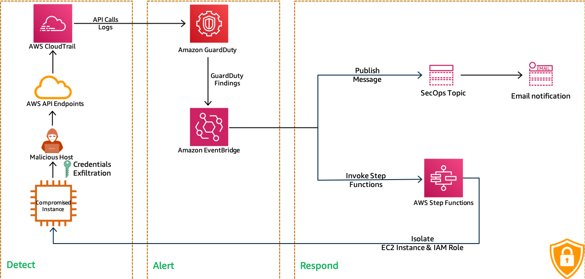

# AWS Security - Incident Response

  Lets isolate that errant instances and dump it for analysis
  
  

  Follow this article in **[Youtube](https://youtu.be/a4gOXBrVe6w)**

1. ## Prerequisites

    - AWS CLI pre-configured - [Get help here](https://youtu.be/TPyyfmQte0U)
    - GuardDuty Enabled in the same region[Get help here](https://youtu.be/ybh_556IMpk)
    - EC2 Instance Running with an IAM Role attached
      - IAM Role - _i.e_ `s3_access` - _with managed permissions_ [Get Help for setting up IAM Role](https://www.youtube.com/watch?v=5g0Cuq-qKA0&list=PLxzKY3wu0_FLaF9Xzpyd9p4zRCikkD9lE&index=11)
            - `AmazonS3ReadOnlyAccess` - To allow s3 access for ec2

1. ## Clone the repository

    Lets clone the repo locally to customize it to suit your needs.

    ```bash
    git clone git@github.com:miztiik/security-incident-response-instance-isolation.git
    cd security-incident-response-instance-isolation
    ```

1. ## Customize the deployment

    Edit the `./helper_scripts/deploy.sh` to update your environment variables.
  
    ```bash
    AWS_PROFILE="default"
    AWS_REGION="us-east-1"
    BUCKET_NAME="sam-templates-011" # bucket must exist in the SAME region the deployment is taking place
    SERVICE_NAME="Miztiik-Incident-Response"
    TEMPLATE_NAME="incident_response.yaml" # The CF Template should be the same name, If not update it.
    STACK_NAME="incidentResponse"
    OUTPUT_DIR="./outputs/"
    PACKAGED_OUTPUT_TEMPLATE="${OUTPUT_DIR}${STACK_NAME}-packaged-template.yaml"
    info_sec_ops_mail="youremail@gmail.com"
    ```

1. ## Deployment

    We will use the `deploy.sh` in the `helper_scripts` directory to deploy our [AWS SAM](https://github.com/awslabs/serverless-application-model) template

    ```bash
    chmod +x ./helper_scripts/deploy.sh
    ./helper_scripts/deploy.sh
    ```
  
1. ## Test the Solution

    - Connect to EC2 instance and execute the following command, Dont forget to update the `role_name` with the IAM Role attached to the EC2 instance. You will receive an access key

    ```bash
    role_name="s3_access"
    curl http://169.254.169.254/latest/meta-data/iam/security-credentials/${role_name}
    ```

    Output looks like,

    ```bash
    "AccessKeyId" : "AZIAUR7KWXJQNUIO4CW5",
    "SecretAccessKey" : "f87Sp/3Fc7cpRGWwagzGSZuI1PWZZhIfp1r6I8FZ",
    "Token" : "IQoJb3JpZ2luX.......SOMETHING....HERE..............TkDA=="
    ```

    - Open a local terminal,(not the EC2 instance).
    From the prevous output, replace the values for these, and run them,
    _**Note**: Make sure the token does not have line breaks_

    ```bash
    export AWS_ACCESS_KEY_ID="YOUR-ACCESS-KEY"
    export AWS_SECRET_ACCESS_KEY="YOUR-SECRET-KEY"
    export AWS_SESSION_TOKEN="YOUR-TOKEN"
    ```

    - Lets check if we can query S3 with these new credentials,

    ```bash
      aws sts get-caller-identity
      aws s3 ls
      unset AWS_ACCESS_KEY_ID
      unset AWS_SECRET_ACCESS_KEY
      unset AWS_SESSION_TOKEN
      aws sts get-caller-identity
      date
      ```

1. ## Verify the Security Breach

    - Check the `GuardDuty` service page for any new findings.

      _**Note**: Typically, it takes about ~20 to 30 minutes for GuardDuty to raise a finding. Within 5 Minutes of a finding, A CloudWatch Event is triggered._

    - Check the StateMachine Execution

      The following actions should have taken place,

      1. An new security group added to the EC2 Instance
      1. An snapshot of the EC2 instance created
      1. An `DenyAll` policy attached to the IAM Role, attached to the EC2 Instance.

    Now that we have confirmed the solution is working, you can extend the solution as required.

1. ## Next Steps: Do Try This

    There are SNS notification resources, pre-baked in this solution. Go ahead and finish the configuration so you can get notified about findings.

1. ## CleanUp

    If you want to destroy all the resources created by the stack, Execute the below command to delete the stack, or _you can delete the stack from console as well_

    1. Disable/Suspend GuardDuty as required
    1. Delete QURANTINE EBS Snapshots
    1. Delete QUARANTINE Security Group
    1. Delete QUARANTINE Deny all policy
    1. Delete the stack,

    ```bash
    # Delete the CF Stack
    ./helper_scripts/deploy.sh nuke
    ```

## Buy me a coffee

Buy me a coffee ☕ here `https://paypal.me/valaxy`, _or_ You can reach out to get more details through [here](https://youtube.com/c/valaxytechnologies/about).

### References

1. [Amazon GuardDuty findings](https://docs.aws.amazon.com/guardduty/latest/ug//get-findings.html#get-findings-response-syntax)
1. [CloudWatch Events Event Examples From Supported Services](https://docs.aws.amazon.com/AmazonCloudWatch/latest/events/EventTypes.html)
1. [Configure a CloudWatch events rule for GuardDuty](https://aws.amazon.com/premiumsupport/knowledge-center/guardduty-cloudwatch-sns-rule/)

### Metadata

**Level**: 400